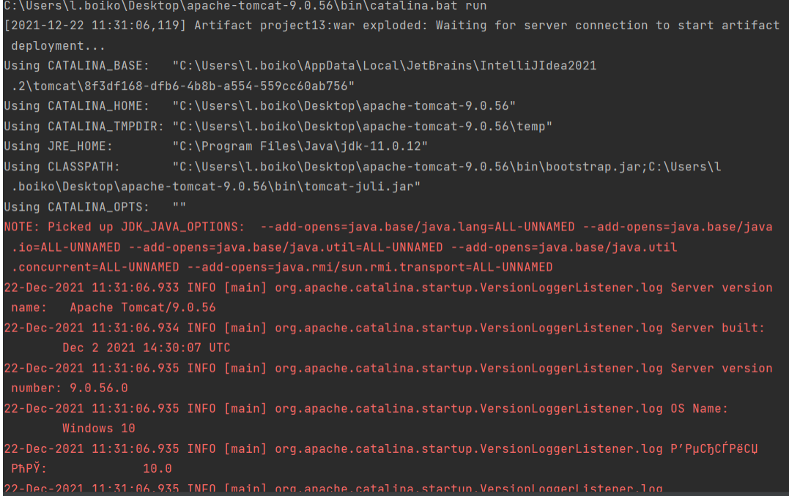

# servlet-for-wise-quotes

### 1. Постановка задачи:

Программа реализует отправку мудрых цитат пользователю через браузер. Для реализации соблюдены следующие условия:
• Использован протокол HTTP;
• Архитектура "клиент-сервер";
• Веб-сервер умеет работать с несколькими клиентами;
• Веб-сервер умеет отвечать на динамические запросы;
• Исполняемый код упакован в jar.

Реализованы следующие базовые функции:
• На сервере хранится десяток цитат;
• Несколько человек на сервере могут просматривать цитаты одновременно.

### 2. Руководство пользователя:
Для запуска сервера необходимо запустить функцию Tomcat 9.0.56 файл (рис. 1.) и сервер начнет свою работу(рис. 2.):

После запуска сервера клиенту необходимо зайти по определенному адресу и при нажатии кнопки
"GET WISDOM"получит свою первую цитату:

Если клиент хочет получить новую цитату, то он должен просто нажать на кнопку "GET WISDOM":

### 3. Архитектура проекта:

Программа имеет архитектуру клиент-сервер. Данные клиент получает от сервера после соответствующего запроса. Запрос отправляется с клиента на сервер, сервер производит обработку данных и отсылает данные клиенту.

### 4. Описание реализации:

Проект построен на Framework Tomcat. Tomcat это сервер приложений. В Tomcat мы добавляем прописанное нами приложение WisdomServlet.java, которое, в свою очередь, будет срабатывать при вызове
заранее определенного адреса в поисковой строке браузера и вызывать в нашем WisdomServlet.java
запрос на обработку данных HttpServletRequest. После обработки наше приложение должно отправить
ответ HttpServletResponse и заполнить страницу браузера по прописанному алгоритму.
